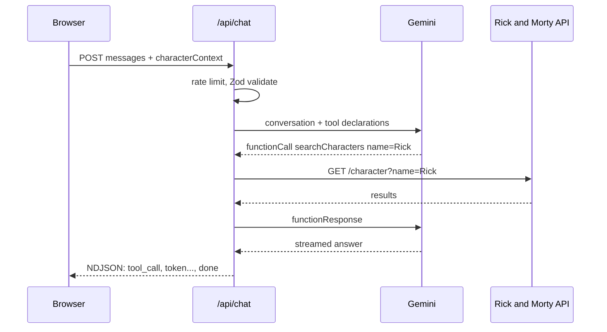

# Rick and Morty Explorer

[](https://github.com/YuthramysI/RickyandMorty/actions/workflows/ci.yml)
[](LICENSE)
[](https://nextjs.org/)
[](https://www.typescriptlang.org/)

Browse the Rick and Morty multiverse and chat with an AI assistant that looks up real character and episode data instead of guessing.

### **[▶ Live demo](https://rickyandmorty-rust.vercel.app/)**


---

## What this project demonstrates

It is a small app, but every part of it is built the way a production feature would be. If you are evaluating the code, these are the parts worth reading:

| Area                      | What to look at                                                                                                                                             |
| ------------------------- | ----------------------------------------------------------------------------------------------------------------------------------------------------------- |
| **LLM function calling**  | A real tool-calling loop against a live API - not a wrapper around a single prompt. [`lib/gemini/orchestrate.ts`](lib/gemini/orchestrate.ts)                |
| **Streaming**             | Hand-rolled NDJSON streaming over POST, consumed incrementally in the browser. [`lib/chat/sse.ts`](lib/chat/sse.ts), [`hooks/useChat.ts`](hooks/useChat.ts) |
| **Resilient networking**  | Retries with exponential backoff, a total time budget, and a concurrency limiter. [`lib/rickandmorty/client.ts`](lib/rickandmorty/client.ts)                |
| **Secret handling**       | The API key is read only inside a Route Handler and never crosses to the client. [Details below](#keeping-the-api-key-server-only)                          |
| **Defensive server code** | Zod-validated input, per-IP rate limiting, capped tool rounds, and a strict CSP. [Details below](#security)                                                 |
| **Real-world edge cases** | Cached upstream 404s, browser auto-translate crashes, mobile viewport insets. [Details below](#engineering-notes)                                           |
| **Tests + CI**            | Vitest suite on the logic that actually breaks, gated on every push. [Details below](#testing--ci)                                                          |

## Features

- **Character browser** - paginated list of every character, with debounced name search and filters for status, species, and gender. Filters live in the URL, so any view is shareable and the back button works.
- **Character detail pages** - image, status, species, first appearance, and every episode the character appears in. Origin and current location are enriched with their dimension and type, and the page surfaces other characters last seen at the same location.
- **AI chat with real function calling** - the standout feature. A floating assistant, powered by Gemini, answers questions by calling live tools (`searchCharacters`, `getCharacter`, `getEpisode`, `getCharactersByIds`) that query the Rick and Morty API in real time, instead of relying on the model's training data.
- **Context-aware chat** - while viewing a character's detail page, the chat already knows which character you're looking at, so "tell me more about this one" works without repeating the name.
- **Streaming responses** - replies stream in token by token, with a "looking things up..." indicator while a tool call is in flight.
- **Light/dark mode**, a mobile-first responsive layout, and animated micro-interactions throughout.

## Tech stack

|            |                                                                                          |
| ---------- | ---------------------------------------------------------------------------------------- |
| Framework  | [Next.js 16](https://nextjs.org/) (App Router, React Server Components)                  |
| Language   | TypeScript (strict)                                                                      |
| Styling    | [Tailwind CSS v4](https://tailwindcss.com/) (CSS-first config)                           |
| Animation  | [Framer Motion](https://motion.dev/)                                                     |
| AI         | [`@google/genai`](https://www.npmjs.com/package/@google/genai) - Gemini function calling |
| Validation | [Zod](https://zod.dev/)                                                                  |
| Testing    | [Vitest](https://vitest.dev/) + GitHub Actions                                           |
| Data       | [Rick and Morty API](https://rickandmortyapi.com/)                                       |

## Getting started

### Prerequisites

- Node.js 20+
- [pnpm](https://pnpm.io/) (`corepack enable` will make it available if you don't have it)
- A Gemini API key - create one for free at [Google AI Studio](https://aistudio.google.com/app/apikey)

### Setup

```bash
pnpm install
cp .env.example .env.local
```

Open `.env.local` and add your Gemini key:

```
GEMINI_API_KEY=your-key-here
```

Then run the dev server:

```bash
pnpm dev
```

Visit [http://localhost:3000](http://localhost:3000).

> The browser experience works without a key - only the chat needs one. Without it, the chat returns a clear "not configured" message rather than failing silently.

### Available scripts

| Command             | Description                       |
| ------------------- | --------------------------------- |
| `pnpm dev`          | Start the dev server              |
| `pnpm build`        | Production build                  |
| `pnpm start`        | Run the production build          |
| `pnpm lint`         | Lint the codebase                 |
| `pnpm format`       | Format the codebase with Prettier |
| `pnpm format:check` | Check formatting without writing  |
| `pnpm test`         | Run the unit test suite (Vitest)  |

## Project structure

```
app/
  api/chat/route.ts        Chat endpoint: rate limit -> validate -> stream
  characters/              List and detail routes, with loading/error/not-found states
components/
  characters/  chat/  home/  layout/  theme/  ui/
hooks/
  useChat.ts               Streaming client: reads the NDJSON body incrementally
lib/
  rickandmorty/            Typed API client - retries, caching, concurrency limit
  gemini/                  Tool declarations, orchestration loop, system prompt
  chat/                    Zod schemas, rate limiter, NDJSON stream helper
  theme/  viewport/        useSyncExternalStore-backed browser state
types/                     Shared domain and chat-protocol types
```

The `lib/rickandmorty` module is the single source of truth for data access: Server Components and the Gemini tool handlers both call the same functions, so there is no duplicated fetch logic and no second way for a request to be built.

## Architecture

### Keeping the API key server-only

The Gemini key is read exclusively from `process.env.GEMINI_API_KEY` inside a Route Handler ([`app/api/chat/route.ts`](app/api/chat/route.ts)), which only ever runs on the server. The browser talks to `/api/chat` on the same origin and never receives the key or a token derived from it. It is never assigned to a `NEXT_PUBLIC_*` variable, never placed in `localStorage`, and never included in a client component's props. `.env.local` is gitignored; `.env.example` documents the variables with empty values.

### Function calling

When you send a message, [`lib/gemini/orchestrate.ts`](lib/gemini/orchestrate.ts) sends the conversation to Gemini along with a set of tool declarations. If the model needs real data it responds with a function call instead of text; the server executes the matching handler against the Rick and Morty API, feeds the result back as a function response, and repeats until the model can answer in natural language.



Three details make this work in practice rather than just in a demo:

- **Tool rounds are capped** (`CHAT_MAX_TOOL_ROUNDS`) so a confused model cannot loop indefinitely at your expense.
- **Tool failures become data, not exceptions.** A "character not found" is returned to the model as a structured result so it can rephrase, instead of throwing and killing the stream.
- **Raw response parts are preserved** across the round trip. Newer Gemini models attach a `thoughtSignature` to function calls and reject the follow-up request if it is missing, so the loop stores the parts it received rather than rebuilding them.

### Streaming protocol

The endpoint is a POST, so `EventSource` (GET-only) is not an option. Instead the server writes newline-delimited JSON into a `ReadableStream`, and the client reads it with `response.body.getReader()`. Each line is one event from a discriminated union - `tool_call`, `token`, `done`, `error` - which keeps the client's handling exhaustive and type-checked.

### Character context

If you are on a character's detail page, the client sends that character's id. The server **re-fetches the character itself** rather than trusting the client-supplied detail, and folds a fresh summary into the system prompt. Client input decides _what_ to look up; it never decides _what is true_.

### Resilient data fetching

[`lib/rickandmorty/client.ts`](lib/rickandmorty/client.ts) wraps every upstream call with:

- a **concurrency limiter** (6 in flight) so a page rendering many lookups cannot open dozens of sockets at once,
- **retries with exponential backoff** that honour a `Retry-After` header when the upstream sends one,
- an **8s total budget** per logical request, so a stalled upstream fails fast instead of hanging until the serverless function times out,
- **`AbortController` timeouts** on each individual attempt, so one stalled connection cannot hold a concurrency slot forever.

## Security

| Concern                  | How it is handled                                                                                |
| ------------------------ | ------------------------------------------------------------------------------------------------ |
| Secret exposure          | Key is server-only; no `NEXT_PUBLIC_*`, no tokens in `localStorage` or cookies                   |
| Untrusted input          | Every request body is parsed with a Zod schema; message count and length are capped              |
| Abuse / cost             | Per-IP fixed-window rate limit with a `Retry-After` response, plus a hard cap on tool rounds     |
| Privilege                | There is no auth and no user data - the app has no privileged state a client could reach for     |
| Injection & clickjacking | Strict CSP (`default-src 'self'`, `frame-ancestors 'none'`), `X-Frame-Options: DENY`, `nosniff`  |
| Transport                | HSTS with `preload`, `Cross-Origin-Opener-Policy: same-origin`, restrictive `Permissions-Policy` |
| Error leakage            | Provider errors are mapped to friendly messages instead of surfacing raw API JSON to users       |

`'unsafe-eval'` is added to the CSP **only** in development, where React's dev build uses `eval()` for stack traces. The policy that ships to real visitors does not include it. See [`next.config.ts`](next.config.ts).

## Engineering notes

A few problems that only show up once something is actually deployed, and what was done about them:

- **Next.js caches unsuccessful responses too.** The upstream API intermittently returns a spurious 404 under load, and `fetch(url, { next: { revalidate: 3600 } })` will happily cache that 404 for an hour - so a character that failed once stayed broken. Retries now bypass the cache with `cache: "no-store"`, and 404 is treated as retryable.
- **Browser auto-translate crashes React.** Translation rewrites the text nodes React is streaming tokens into, and React then throws `NotFoundError` on `removeChild`, taking the page down. The streaming surface is marked `translate="no"` on a _stable_ container (swapping between an empty state and a populated list defeated the first attempt), backed by a defensive `Node.prototype` guard in [`lib/dom-safety.ts`](lib/dom-safety.ts) and an error boundary that can restart just the widget.
- **Mobile browsers hide bottom-fixed elements.** The layout viewport extends behind the URL bar and the on-screen keyboard, so a chat button pinned to `bottom: 1rem` can render off-screen until the page is scrolled. [`lib/viewport/store.ts`](lib/viewport/store.ts) measures the real visible area via `visualViewport` and offsets the dock, and the panel shrinks to fit rather than overflowing off the top.
- **Blank environment variables are not missing ones.** Hosting dashboards happily store an empty string, which `??` passes through. Defaults use `||` so a blank value falls back too.

## Testing & CI

A focused Vitest suite covers the parts most worth guarding against regressions rather than chasing a coverage number:

| Suite                                                                | What it pins down                          |
| -------------------------------------------------------------------- | ------------------------------------------ |
| [`lib/rickandmorty/client.test.ts`](lib/rickandmorty/client.test.ts) | Retry, backoff, and cache-bypass behaviour |
| [`lib/chat/validation.test.ts`](lib/chat/validation.test.ts)         | Request schema boundaries                  |
| [`lib/chat/rateLimit.test.ts`](lib/chat/rateLimit.test.ts)           | Window expiry and per-client isolation     |

Run them with `pnpm test`. Every push and pull request to `main` runs lint, a format check, the production build, and the test suite via [GitHub Actions](.github/workflows/ci.yml).

## Known limitations

Documented deliberately, because knowing where a design stops holding is part of the design.

- **Rate limiting is per-instance.** The limiter ([`lib/chat/rateLimit.ts`](lib/chat/rateLimit.ts)) keeps its counters in memory, which only holds within a single warm serverless instance. This was verified on Vercel: truly concurrent requests can land on separate instances, each with an independent counter, so the limit is not reliably enforced under real concurrency. On Gemini's free tier the practical impact is availability - the daily quota drains faster - not billing. A deployment where that distinction matters should swap in something like [`@upstash/ratelimit`](https://github.com/upstash/ratelimit) backed by Redis, which shares state across instances.
- **Gemini's free tier is limited**, and each model has its own daily quota. The default, `gemini-3.5-flash-lite`, has more headroom than the full `gemini-3.5-flash`, but a busy demo day can still exhaust it. The chat shows a friendly "hit its usage limit" message rather than a raw error when that happens.
- **No authentication or server-side persistence** - out of scope for this iteration. Chat history lives in component state and is intentionally not persisted.

## Deploying to Vercel

1. Push this repository to GitHub.
2. Import it into [Vercel](https://vercel.com/new).
3. Add the `GEMINI_API_KEY` environment variable (and optionally `GEMINI_MODEL` / `RICKANDMORTY_API_BASE`) in the project's settings.
4. Deploy.

No other configuration is required - the security headers, image domains, and caching rules all live in [`next.config.ts`](next.config.ts) and ship with the build.

## License

MIT - see [LICENSE](LICENSE).
